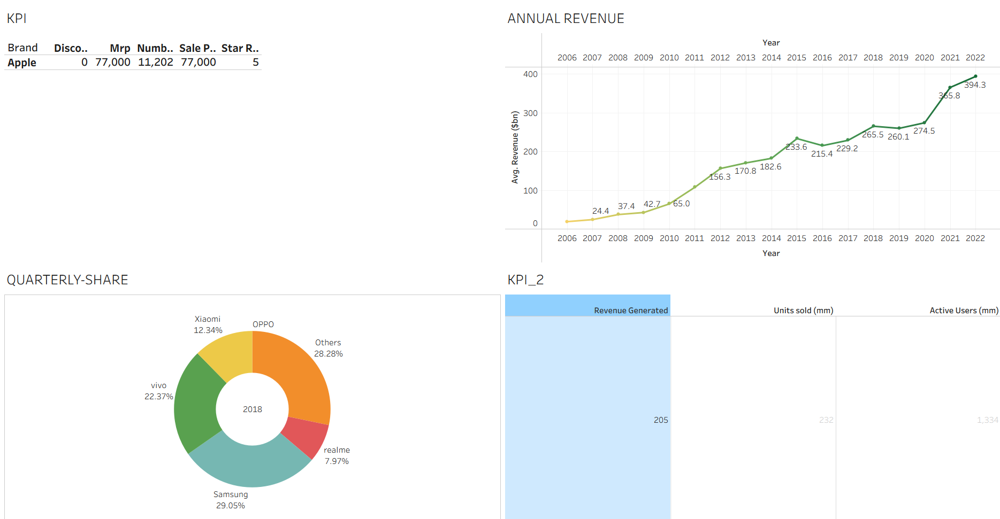
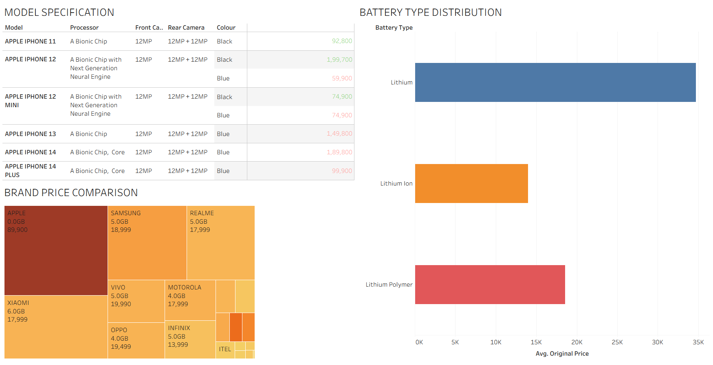
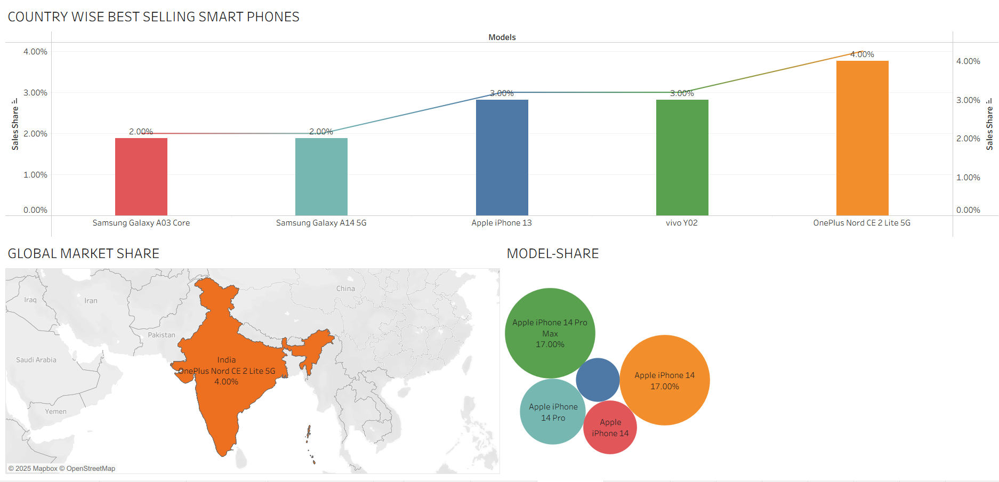
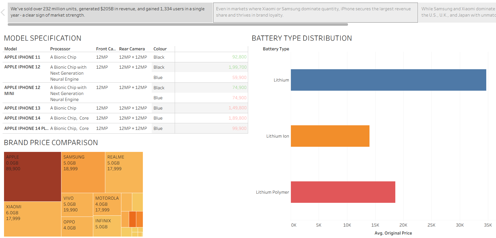
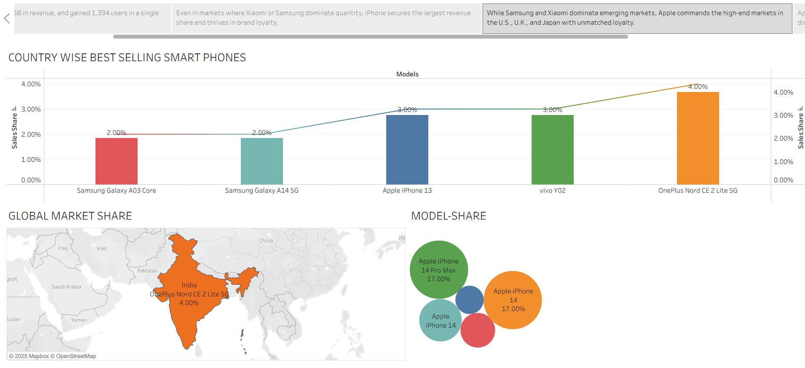

# 📊 iRevolution: A Data-driven Exploration of Apple's iPhone Impact in India using Tableau

---

## 🔍 Overview

This project analyzes the impact of Apple's iPhone in the Indian market using *interactive Tableau dashboards*. It includes KPIs, revenue trends, and market share visuals.

---

## 📁 Files Included

- 📊 ProjectFileSmartBridge.twbx – Tableau workbook with dashboards & stories  
- 📈 apple_products.xlsx – Raw dataset  
- 📷 PNG snapshots of dashboards and stories  

---

## 📸 Dashboard Previews

### 🧭 Dashboard 1  

### 📈 Dashboard 2  

### 📊 Dashboard 3  

---

## 📚 Story Highlights

### Story 1  

### Story 2  

---

## 🛠 Tools Used

- Tableau Public  
- Microsoft Excel  
- GitHub

---

## 🙌 Created by:

Abhinav - SmartInternz Project 2025
